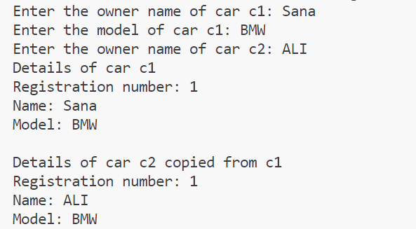
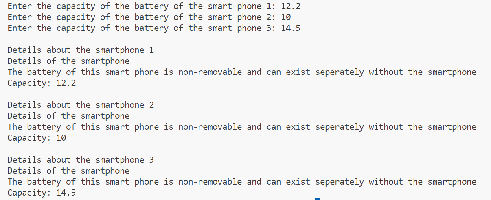
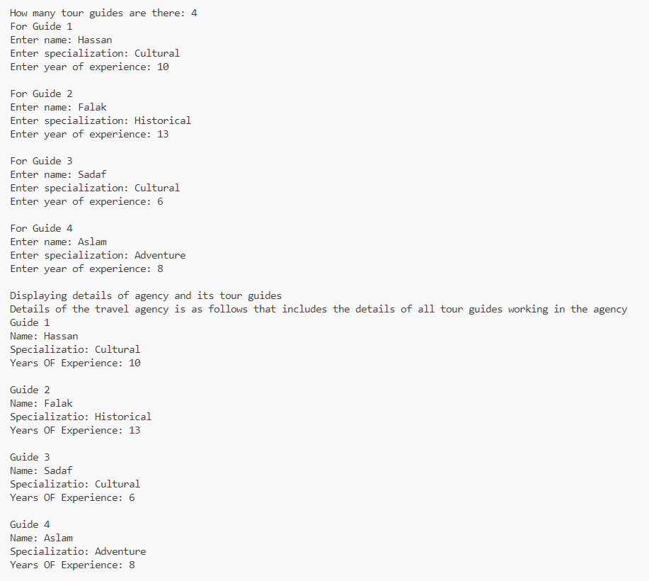
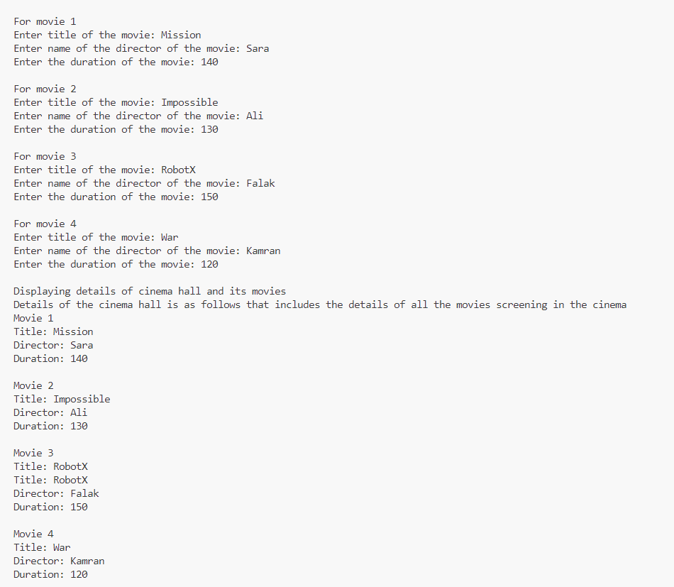
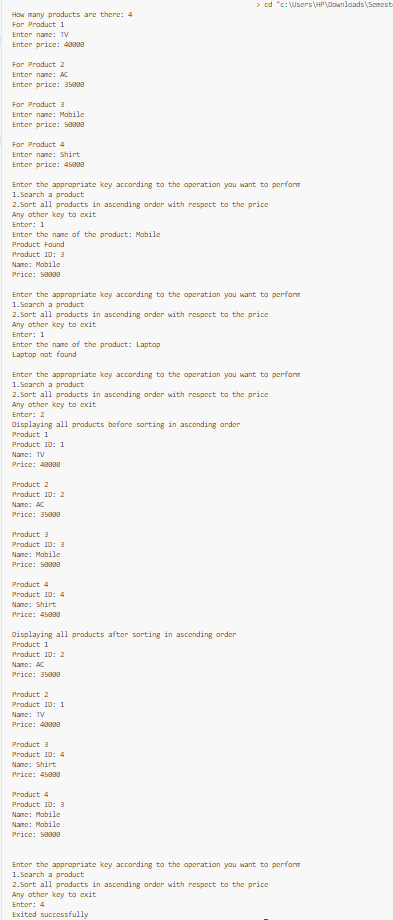

# OOP-LAB-5-24K-0762

# C++ Code Repository

## Preview
Here are the sample outputs of the programs:

### Task 1 Output:


### Task 2:


### Task 3:


### Task 4:


### Task 5:


### Task 6:


### Task 7:



---

## Code
Below are the C++ programs:

### Program 1: 
```cpp
#include<iostream>
using namespace std;
class Car{
    int reg_num;
    static int counter;
    string owner_name,model;
    public:
        Car(string name,string model){
            owner_name=name;
            reg_num=counter;
            counter++;
            this->model=model;
        }
        Car(string name,Car &obj){
            reg_num=obj.reg_num;
            owner_name=name;
            model=obj.model;
        }
        void display(){
            cout<<"Registration number: "<<reg_num<<endl<<"Name: "<<owner_name<<endl<<"Model: "<<model<<endl;
        }
};
int Car::counter=1;
int main(){
    string owner_name,model;
    cout<<"Enter the owner name of car c1: ";
    cin>>owner_name;
    cout<<"Enter the model of car c1: ";
    cin>>model;
    Car c1(owner_name,model);
    cout<<"Enter the owner name of car c2: ";
    cin>>owner_name;
    Car c2(owner_name,c1);
    cout<<"Details of car c1"<<endl;
    c1.display();
    cout<<endl<<"Details of car c2 copied from c1"<<endl;
    c2.display();
    return 0;
}


## Code
Below are the C++ programs:

### Program 2: 
```cpp
#include <iostream>
using namespace std;
class Patient{
    int id;
    static int counter;
    string name,*test_results;
    public:
        Patient(string name, string result[], int n){
            this->name=name;
            id=counter;
            counter++;
            test_results = new string[n];
            for(int i=0;i<n;i++){
                test_results[i]=result[i];
            }
        }
        Patient(const Patient &obj, int n){
            test_results=new string[n];
            for(int i=0;i<n;i++){
                test_results[i]=obj.test_results[i];
            }
            name=obj.name;
            id=obj.id;
        }
        void display(int n){
            cout<<"Patient ID: "<<id<<endl<<"Name: "<<name<<endl<< "Test results" << endl;
            for(int i=0;i<n;i++){
                cout<<"Test "<<i+1<<": "<<test_results[i]<<endl;
            }
        }
};
int Patient::counter = 1;
int main(){
    int n;
    string name;
    cout<<"Enter the name of the patient: ";
    cin>>name;
    cout<<"How many tests are there: ";
    cin>>n;
    string result[n];
    for(int i=0;i<n;i++){
        cout<<"Result of test "<<i+1<<": ";
        cin>>result[i];
    }
    Patient p1(name,result,n);
    Patient analiyze_p1(p1,n);
    cout<<"Details for patient p1"<<endl;
    p1.display(n);
    cout<<endl<<"Analyize p1 details copied from p1 for the analysis of patient p1"<<endl;
    analiyze_p1.display(n);
    return 0;
}


## Code
Below are the C++ programs:

### Program 3: 
```cpp
#include<iostream>
using namespace std;
class Professor{
    string name,department;
    public:
        void set_details(string name,string dept){
            this->name=name;
            department=dept;
        }
        void display_professors(Professor p[],int n){
            if(n==0){
                cout<<"No proffessors found"<<endl;
            }
            else{
                for(int i=0;i<n;i++){
                    cout<<"Professor "<<i+1<<endl<<"Name: "<<p[i].name<<endl<<"Department: "<<p[i].department<<endl<<endl;
                }
            }
        }
};
class University{
    Professor *prof=NULL;
    public:
        void add_professor(Professor *p,int *total,int new_total){
            Professor *new_prof=new Professor[new_total];
            for (int i = 0; i < *total; i++){
                new_prof[i]=prof[i];
            }   
            new_prof[*total]=*p;
            if(prof!=NULL){
                delete[] prof;
            }    
            prof=new_prof;
            *total=new_total;
            cout<<"Professor added successfully"<<endl;
        }
        void display(int n){
            cout<<"Details of university are as follows which includes the details of all the professors working"<<endl;
            cout<<"University Name: FAST University"<<endl;
            if(n!=0){
                prof->display_professors(prof,n);
            }
            else{
                cout<<"No professor found"<<endl;
            }
        }
        
        ~University(){
            delete[] prof;
        }
};
int main(){
    int c,total=0,new_total;
    Professor *prof=NULL;
    University uni;
    string dept,name;
    while(1){
        cout<<"Enter the appropriate key according to the function you want to perform\n1.Add a professor\n2.Display university details\nAny other key to exit\nEnter: ";
        cin>>c;
        switch(c){
            case 1:
                new_total=total+1;
                Professor *new_prof;
                new_prof=new Professor[new_total];
                for (int i = 0; i < total; i++){
                    new_prof[i]=prof[i];
                }
                cout<<"Enter name: ";
                cin>>name;
                cout<<"Enter department: ";
                cin>>dept;
                new_prof[total].set_details(name,dept);    
                if(prof!=NULL){
                    delete[] prof;
                }    
                prof=new_prof;   
                uni.add_professor(&prof[total],&total,total+1);
                total=new_total;
                break;
            case 2:
                uni.display(total);                
                break;
            default:
                cout<<"Exited successfully";
                delete[] new_prof,prof;
                return 0;
                break;
        }
        cout<<endl;
    } 
}


## Code
Below are the C++ programs:

### Program 4: 
```cpp

#include<iostream>
using namespace std;
class Battery{
    float capacity;
    public:
        Battery(float c){
            capacity=c;
        }
        void display(){
            cout<<"Capacity: "<<capacity<<endl;
        }
};
class Smartphone{
    Battery b;
    public:
        Smartphone(float c) :b(c){}
        void display(){
            cout<<"Details of the smartphone"<<endl<<"The battery of this smart phone is non-removable and can exist seperately without the smartphone"<<endl;
            b.display();
        }
};
int main(){
    float c;
    cout<<"Enter the capacity of the battery of the smart phone 1: ";
    cin>>c;
    Smartphone phone1(c);
    cout<<"Enter the capacity of the battery of the smart phone 2: ";
    cin>>c;
    Smartphone phone2(c);
    cout<<"Enter the capacity of the battery of the smart phone 3: ";
    cin>>c;
    Smartphone phone3(c);
    cout<<endl<<"Details about the smartphone 1"<<endl;
    phone1.display();
    cout<<endl<<"Details about the smartphone 2"<<endl;
    phone2.display();
    cout<<endl<<"Details about the smartphone 3"<<endl;
    phone3.display();
    return 0;
}


## Code
Below are the C++ programs:

### Program 5: 
```cpp

#include<iostream>
using namespace std;
class TourGuide{
    string name,spectialization;
    int years_of_experience;
    public:
        void set_details(string n,string spectial,int experience){
            name=n;
            spectialization=spectial;
            years_of_experience=experience;
        }
        void display_details(){
            cout<<"Name: "<<name<<endl<<"Specializatio: "<<spectialization<<endl<<"Years OF Experience: "<<years_of_experience<<endl<<endl;
        }
};
class TravelAgency{
    TourGuide *guide;
    public:
        TravelAgency(int n){
            guide=new TourGuide[n];
        }
        void hire_guide(int i,TourGuide g){
            guide[i]=g;
        }
        void display(int n){
            cout<<"Details of the travel agency is as follows that includes the details of all tour guides working in the agency"<<endl;
            for(int i=0;i<n;i++){
                cout<<"Guide "<<i+1<<endl;
                guide[i].display_details();
            }
        }
        ~TravelAgency(){
            delete[] guide;
        }
};
int main(){
    int n,exp;
    string special,name;
    cout<<"How many tour guides are there: ";
    cin>>n;
    TravelAgency agency(n);
    TourGuide guide[n];
    for(int i=0;i<n;i++){
        cout<<"For Guide "<<i+1<<endl;
        cout<<"Enter name: ";
        cin>>name;
        cout<<"Enter specialization: ";
        cin>>special;
        cout<<"Enter year of experience: ";
        cin>>exp;
        cout<<endl;
        guide[i].set_details(name,special,exp);
        agency.hire_guide(i,guide[i]);
    }
    cout<<"Displaying details of agency and its tour guides"<<endl;
    agency.display(n);
    return 0;
}


## Code
Below are the C++ programs:

### Program 6: 
```cpp
#include<iostream>
using namespace std;
class Movie{
    string title,director;
    int duration;
    public:
        void set_details(string name,string dir,int time){
            title=name;
            director=dir;
            duration=time;
        }
        void display(){
            cout<<"Title: "<<title<<endl<<"Director: "<<director<<endl<<"Duration: "<<duration<<endl<<endl;
        }
};
class CinemaHall{
    Movie movie[100];
    public:
        CinemaHall(Movie m[],int n){
            for(int i=0;i<n;i++){
                movie[i]=m[i];
            }
        }
        void display(int n){
            cout<<"Details of the cinema hall is as follows that includes the details of all the movies screening in the cinema"<<endl;
            for(int i=0;i<n;i++){
                cout<<"Movie "<<i+1<<endl;
                movie[i].display();
            }
        }
};
int main(){
    int n,duration;
    string title,director;
    cout<<"How many movies are there: ";
    cin>>n;
    Movie movie[n];
    for(int i=0;i<n;i++){
        cout<<"For movie "<<i+1<<endl;
        cout<<"Enter title of the movie: ";
        cin>>title;
        cout<<"Enter name of the director of the movie: ";
        cin>>director;
        cout<<"Enter the duration of the movie: ";
        cin>>duration;
        cout<<endl;
        movie[i].set_details(title,director,duration);
    }
    CinemaHall cinema(movie,n);
    cout<<"Displaying details of cinema hall and its movies"<<endl;
    cinema.display(n);
    return 0;
}


## Code
Below are the C++ programs:

### Program 7: 
```cpp
#include<iostream>
using namespace std;
class Product{
    static int counter;
    string name;
    int price,id;
    public:
        void set_details(string name,int p){
            this->name=name;
            price=p;
            id=counter++;
        }
        void serach_product(Product prod[],int n){
            string prod_name;
            int found=0;
            cout<<"Enter the name of the product: ";
            cin>>prod_name;
            for(int i=0;i<n;i++){
                if(prod_name==prod[i].name){
                    found=1;
                    cout<<"Product Found"<<endl;
                    cout<<"Product ID: "<<prod[i].id<<endl;
                    cout<<"Name: "<<prod[i].name<<endl;
                    cout<<"Price: "<<prod[i].price<<endl;
                }
            }
            if(!found){
                cout<<prod_name<<" not found"<<endl;
            }
        }
        void sort_products_asc(Product prod[],int n){
            cout<<"Displaying all products before sorting in ascending order"<<endl;
            for(int i=0;i<n;i++){
                cout<<"Product "<<i+1<<endl;
                cout<<"Product ID: "<<prod[i].id<<endl;
                cout<<"Name: "<<prod[i].name<<endl;
                cout<<"Price: "<<prod[i].price<<endl;
                cout<<endl;
            }
            for(int i=0;i<n;i++){
                for(int j=i;j<n-1-i;j++){
                    if(prod[j].price>prod[j+1].price){
                        Product temp;
                        temp=prod[j];
                        prod[j]=prod[j+1];
                        prod[j+1]=temp;
                    }
                }
            }
            cout<<"Displaying all products after sorting in ascending order"<<endl;
            for(int i=0;i<n;i++){
                cout<<"Product "<<i+1<<endl;
                cout<<"Product ID: "<<prod[i].id<<endl;
                cout<<"Name: "<<prod[i].name<<endl;
                cout<<"Price: "<<prod[i].price<<endl;
                cout<<endl;
            }
        }
};
int Product::counter=1;
int main(){
    int n,price,c;
    string name;
    cout<<"How many products are there: ";
    cin>>n;
    Product p[n];
    for(int i=0;i<n;i++){
        cout<<"For Product "<<i+1<<endl;
        cout<<"Enter name: ";
        cin>>name;
        cout<<"Enter price: ";
        cin>>price;
        p[i].set_details(name,price);
        cout<<endl;
    }
    while(1){
        cout<<"Enter the appropriate key according to the operation you want to perform\n1.Search a product\n2.Sort all products in ascending order with respect to the price\nAny other key to exit\nEnter: ";
        cin>>c;
        switch(c){
            case 1:
                p->serach_product(p,n);
                break;
            case 2:
                p->sort_products_asc(p,n);
                break;
            default:
                cout<<"Exited successfully";
                return 0;
        }
        cout<<endl;
    }
}


 

